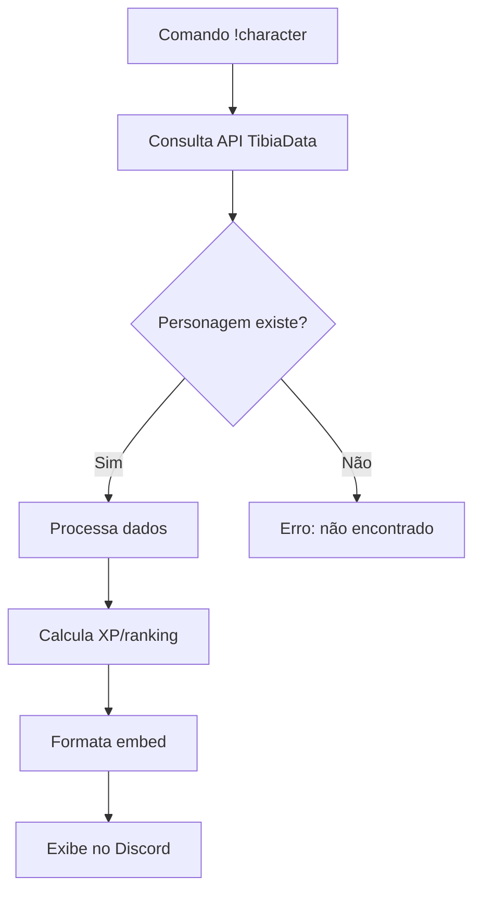

# 🎮 Tibia XP Tracker Discord Bot 🐉  
*Um fanservice criado por jogadores, para jogadores!*  

## 🌟 Sobre o Projeto  
Bot para Discord que consulta dados oficiais de personagens do Tibia via API, mostrando experiência, status e informações detalhadas. Projeto perfeito para treinar lógica de programação e integração com APIs!

```bash
✨ Funcionalidades:
- Consulta de personagens (nível, vocação, mundo)
- Tracking de experiência e ranking
- Status online em tempo real
- Histórico de mortes e último login
```

## ⚙️ Tecnologias Utilizadas
| Ferramenta | Função |
|------------|--------|
| **Python** | Lógica principal |
| **discord.py** | Integração com Discord |
| **Requests** | Comunicação com API |
| **TibiaData API v4** | Dados do jogo |
| **python-dotenv** | Gerenciamento de variáveis |

## 🚀 Configuração Rápida

### 1. Clone o repositório:
```bash
git clone https://github.com/seu-usuario/Tibia_XP_trackerDiscord.git
cd Tibia_XP_trackerDiscord
```

### 2. Crie ambiente virtual (recomendado):
```bash
python -m venv venv
# Ative o ambiente:
# Linux/Mac: source venv/bin/activate
# Windows: .\venv\Scripts\activate
```

### 3. Instale dependências:
```bash
pip install -r requirements.txt
```

### 4. Crie o arquivo .env:
```bash
# Execute na raiz do projeto:
echo "DISCORD_TOKEN=seu_token_aqui" > .env
```

### 🔑 Como obter o token do bot:
1. Acesse [Discord Developer Portal](https://discord.com/developers/applications)
2. Crie uma New Application > Bot > Add Bot
3. Copie o token (em TOKEN)
4. Cole no `.env` substituindo `seu_token_aqui`

### 5. Execute o bot:
```bash
python main.py
```

## 💻 Comandos no Discord
| Comando | Exemplo | Função |
|---------|---------|--------|
| `!character <nome>` | `!character Galarzaa` | Status completo |
| `!xp <nome>` | `!xp Bobeek` | Detalhes de XP |
| `!help` | `!help` | Ajuda |

## 🧠 Lógica de Funcionamento


**Pontos para estudo**:
- Paginação de resultados da API (até 20 páginas)
- Tratamento de erros de API
- Formatação de dados complexos
- Cache de requisições

## 🔮 Futuro
- Tracking de guildas
- Histórico de mortes
- Comparativo de XP/hora
- Notificações de login

## 📜 Licença MIT
```text
Permissões: uso comercial, modificação, distribuição
Restrições: deve incluir licença original
```